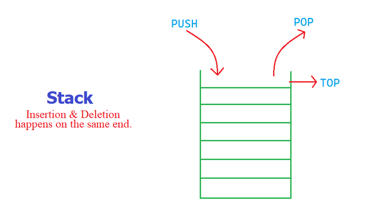
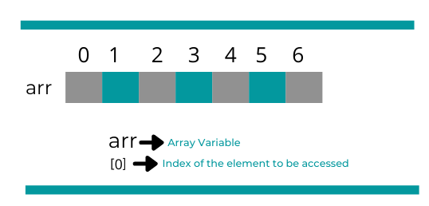

# 자료 구조와 알고리즘
#### 2022.03.27

리눅스를 만들어낸 Linus Torvalds가 이런 글을 쓴 적이 있다고 합니다.

> The difference between a bad programmer and a good one is whether he considers his code or his data structures more important. Bad programmers worry about the code. Good programmers worry about data structures and their relationships.

> 좋은 개발자와 나쁜 개발자는 그가 "코드"와 "데이터 구조" 중 무엇을 더 중요시 하느냐에 따라 구별할 수 있다. 나쁜 개발자는 "코드"를 걱정한다. 좋은 개발자는 "자료 구조"와 "자료 구조들 간의 관계"에 대해서 걱정한다.

그만큼 자료 구조라는 것은 개발자라는 직업에 있어서 중요한 요소입니다.  
오늘은 어떤 자료 구조들이 있고 어떤 특징, 장단점이 있는지 알아보려고 합니다.

# 자료 구조의 종류

자료 구조에는 여러가지가 있습니다. 우리가 흔히 쓰는 배열(Array) 또한 자료 구조의 하나로 다양한 처리에 유용하게 사용해왔습니다. 하지만 배열만으로는 다양한 상황에 적합한 처리를 하는 데에 어려움이 있고 이럴 때를 대비해 어떤 자료 구조들이 있는지 알고 있어야합니다!

1. Array
2. Linked List
3. Stack
4. Queue
5. Tree
6. (Hash Table) 죄송합니다. 게을렀습니다.
7. (Hash Map) 죄송합니다. 게을렀습니다.

## 1. Array

 배열은 가장 기본적인 자료 구조로 거의 모든 개발자들이 가장 먼저 접하는 자료 구조입니다. 길이가 n인 배열의 원소들은 각각 0번부터 n-1번까지의 번호를 가지고 이 번호를 알면 순식간에 원소를 조회할 수 있습니다.

 장점 :
- 단순하다.
- index를 알면 조회가 빠르다.

단점 :
- 길이가 정해져 있다.(길이를 바꾸는게 힘들다)
- 배열 중간에 새로운 원소를 삽입 혹은 원소를 제거할 경우 오래 걸린다.

## 2. LinkedList

 배열 처럼 데이터가 나란히 나열되어 있는 모양새를하고 있지만 성질이 매우 다릅니다. Linked List에서는 Node라는 개념이 등장합니다. 각 Node는 배열의 한칸 처럼 데이터를 하나 들고 있고 자신의 다음 데이터(next)가 무엇인지 알리는 정보가 들어있습니다. 

 

 장점 : 
 - 중간에 원소를 추가하거나 제거할 때 매우 빠르다.
 - 길이가 정해져있지 않다.

 단점 : 
 - 원소가 어디에 있는지 알아도 맨 처음부터 그 위치까지 가야한다.(조회가 느리다.)

 ## 3. Stack

  스택은 물건을 위로 쌓아 올린 것과 마찬가지로 새로운 물건을 추가할 땐 맨 위에 올리고 중간에 있는 물건을 빼기 위해서는 그 위의 물건을 전부 빼내야합니다. 어떻게 보면 배열의 하위호환 같은 불편한 구조 같아 보이지만 이러한 제약이 프로그램 상의 방어기재처럼 작동해 보다 안전한 알고리즘을 작성하는 데에 도움을 줄 수 있습니다. 예를 들어 JVM의 stack 메모리도 이름 그대로 stack 구조를 사용합니다. 메소드 안에서 메소드가 실행될때 안쪽에 있는 메소드의 실행이 끝나야 비로소 바깥 메소드가 끝날 수 있습니다. 나중에 실행된 메소드일수록 먼저 끝나게 되는 이런 모양새를 LIFO(Last in First out)라고 합니다.

  장점 :
  - 잘 모르겠다. 그냥 상황에 맞게 잘 쓰면 좋을 것 같다. 
  
  단점 :
  - Linked List처럼 조회가 느리다.

  ## 4. Queue

  큐는 Stack과 반대로 FIFO(First in First out) 구조 입니다. 맛있는 가게에 줄을 선 것 처럼 먼저 줄에 선 사람이 먼저 가게에 들어가게 됩니다. 먼저 온 사람이 먼저 한다는 방식이 사람에게는 당연하고 공정한 방식이기 때문에 여러 서비스에서 이 구조를 사용합니다.

## 5. Tree

트리 구조는 위에서 본 구조들과 많이 다릅니다. 위의 구조들은 기본적으로 데이터들이 나란히 나열된 구조였다면 트리는 나란한 데이터들이 있는가 하면 위아래로 층이 나누어진 데이터도 있습니다. 
그 중 가장 대표적인 Binary Tree는 각 node가 두개의 노드로 파생되어 점점 가지가 늘어나느 모양새를 띄게 됩니다. 잘 사용한다면 Linked List 보다도 원소의 추가 제거가 빠르고 탐색 알고리즘을 행할때 배열형 자료 구조보다 큰 이점을 가집니다.

# 알고리즘

상황에 적합한 자료 구조를 사용하는 것도 중요하지만 거기에 적합한 알고리즘을 적용 시키는 것도 성능 향상에 큰 영향을 끼칩니다.

오늘은 간단하게 binary search라는 것을 소개하며 알고리즘의 힘에 대해 알아보겠습니다. 

brute force